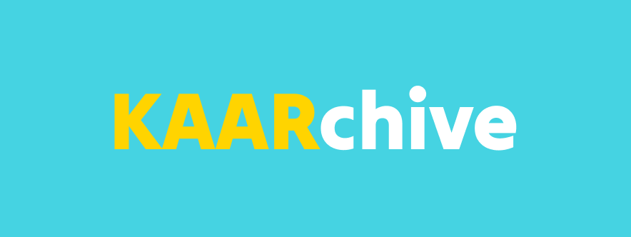
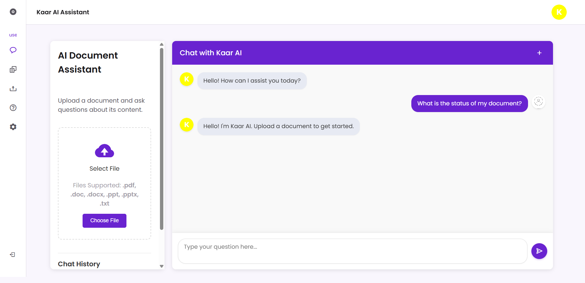
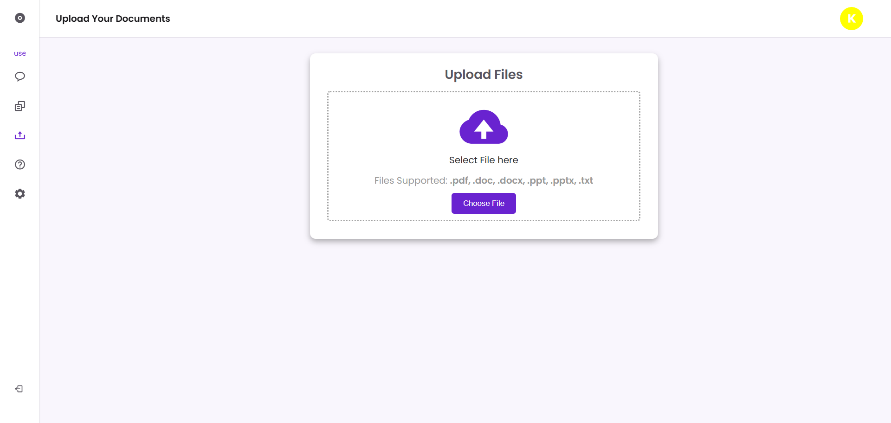
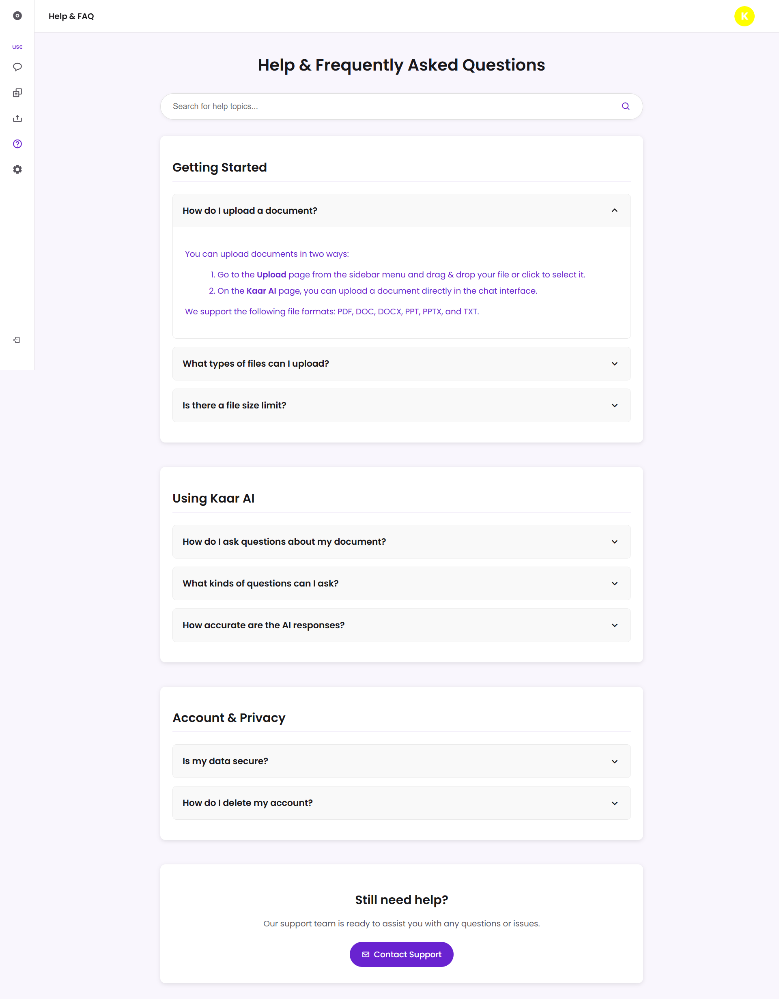
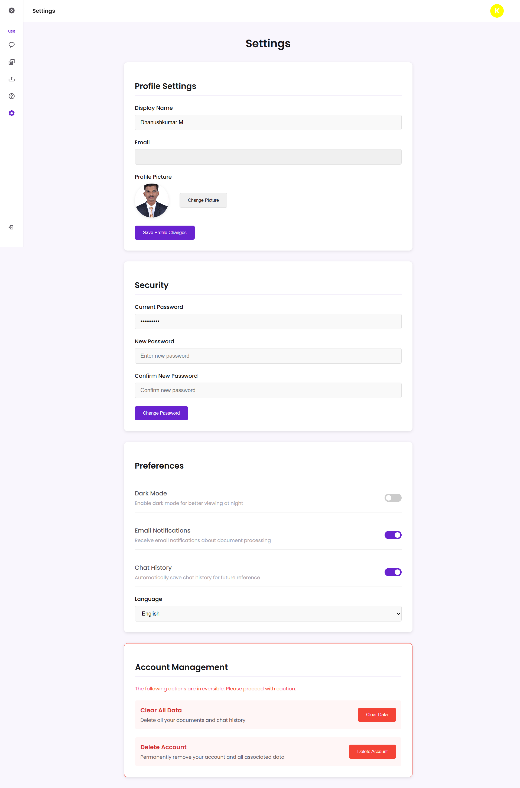
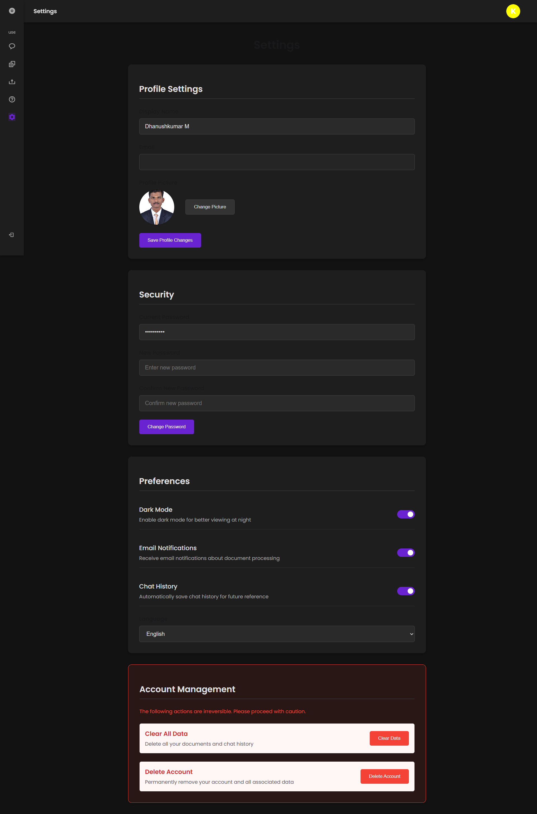

# 📚 KaArchive  

<p align="center">
  
</p>


## 📌 Status  


## 🛠 Tech Stack  

     
    
  
  
  
    
 

## 🚀 Features  
- 📂 Document Upload & Storage (Azure Blob Storage)  
- 🔑 Authentication with JWT & SAS Tokens  
- 🤖 AI-powered document interaction (ChatPDF API Integration)  
- 🔎 Smart Search & Retrieval  
- 🛡 Secure File Handling with Role-based Access  
- 🌐 Responsive Frontend (HTML, CSS, JavaScript)  


## 📸 Screenshots  

|  |  | 
|-------------------------------------|----------------------------------------|


|  |  |  |  
|----------------------------------|--------------------------------------|-------------------------------------------|


## 🏗 Tech Stack Breakdown  

- **Frontend:** HTML5, CSS3, JavaScript  
- **Backend:** C#, ASP.NET Core  
- **Database:** MySQL  
- **Other Services:** Azure Blob Storage, Azure AI Services, ChatPDF API, JWT, SAS Tokens  

## ⚙️ Installation & Setup  

### 📌 Frontend Setup  
```bash
cd Frontend
# Open index.html in a browser or use Live Server (VS Code)
```

### 📌 Backend Setup  
```bash
cd KaarBackend
dotnet restore
dotnet run
```

💻 **Usage**  
---
- Register or Login to the platform.
- Upload documents securely to Azure Blob Storage.
- Interact with documents using AI (ChatPDF API).
- Retrieve and manage your knowledge archive.

🔮 **Future Enhancements**  
---
- 📑 Advanced tagging & categorization  
- 🧑‍🤝‍🧑 Team collaboration spaces  
- 🌍 Multi-language support  
- 📊 Analytics dashboard for insights  

📜 **License**
---
This project is licensed under the Mozilla Public License 2.0.  
See the LICENSE file for details.

👥 **Contributors**  
---

- **[Dhanushkumar M](https://github.com/dhanushkumarms)**  
- **[Jeyanth V P](https://github.com/Jeyanth2005)**  
- **[Jothiswarar S](https://github.com/jothiswarar)**  
- **[Santhosh G](https://github.com/ITZsanthosh369)**  

